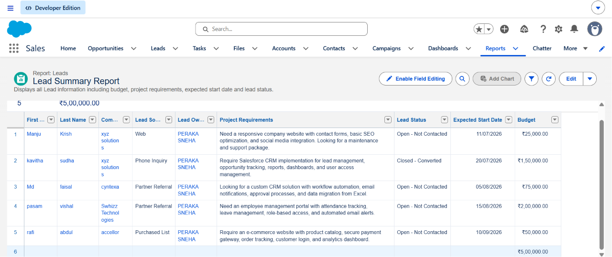
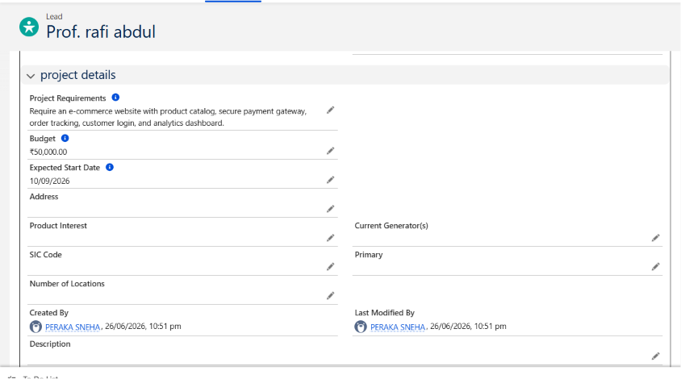
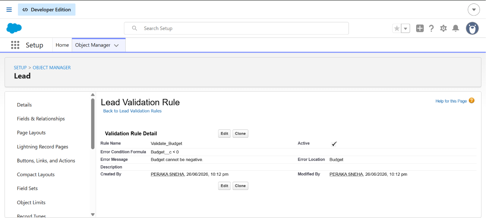
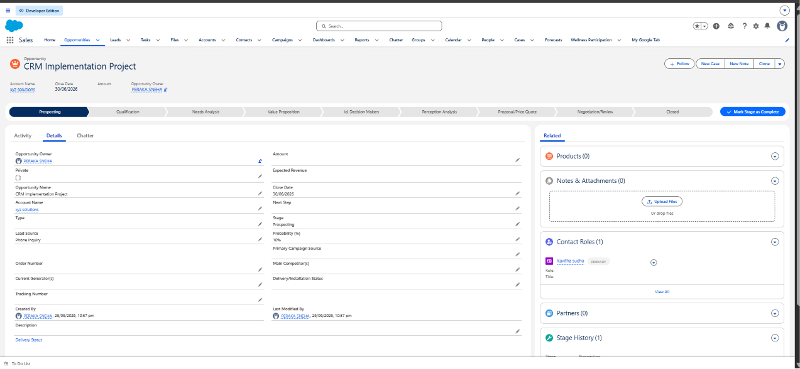
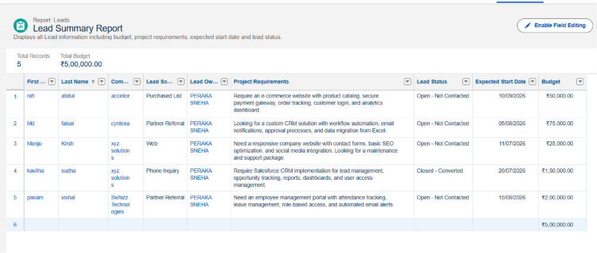
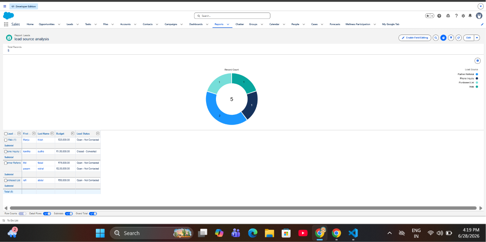
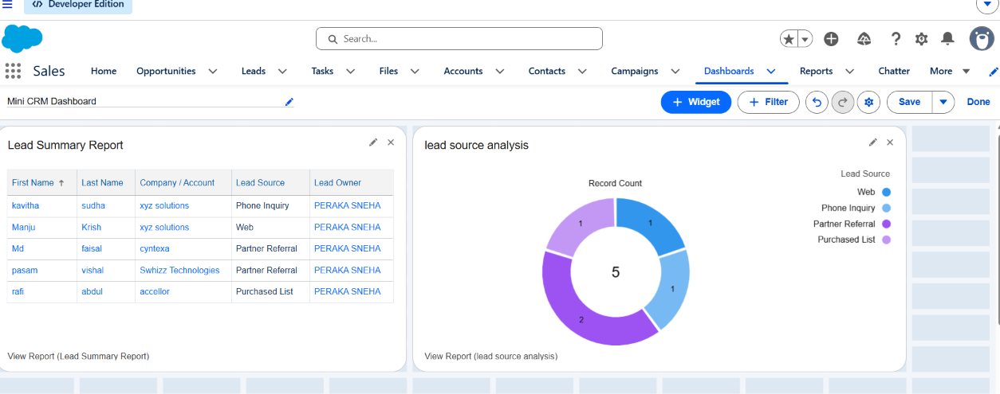

##  Project Screenshots

### 1. Lead List

Shows all Lead records created in the Mini CRM.

---

### 2. Lead Record

Displays the customized Lead page with the Project Details section.

---

### 3. Validation Rule

Prevents users from entering a negative budget value.

---

### 4. Lead Conversion

Shows the conversion of a Lead into an Account, Contact, and Opportunity.

---

### 5. Lead Summary Report

Displays detailed Lead information for business analysis.

---

### 6. Lead Source Analysis

Shows the distribution of Leads by their source using a donut chart.

---

### 7. Mini CRM Dashboard

Provides a consolidated view of Lead reports and analytics.

